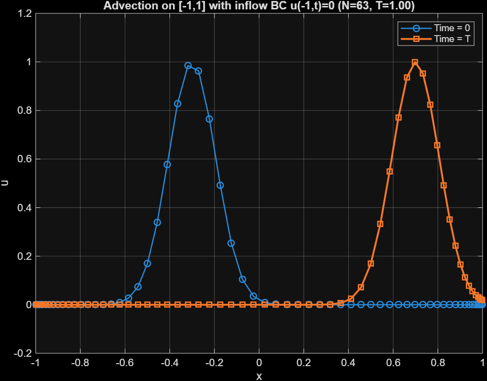

# 1D Advection Solver — Chebyshev Pseudospectral Method with RK4 Time Integration

---

## Table of Contents

1. [Problem Statement](#1-problem-statement)
2. [Why Chebyshev Polynomials](#2-why-chebyshev-polynomials)
3. [Chebyshev Basis and the Discrete Transform](#3-chebyshev-basis-and-the-discrete-transform)
4. [Numerical Differentiation in Chebyshev Space](#4-numerical-differentiation-in-chebyshev-space)
5. [Tau Method — Boundary Condition Enforcement](#5-tau-method--boundary-condition-enforcement)
6. [ODE System for Chebyshev Coefficients](#6-ode-system-for-chebyshev-coefficients)
7. [Time Integration — RK4](#7-time-integration--rk4)
8. [File Structure](#8-file-structure)
9. [Parameters](#9-parameters)
10. [Results](#10-results)

---

## 1. Problem Statement

Solve the **1D linear advection equation** on the domain $x \in [-1, 1]$:

$$\frac{\partial u}{\partial t} + c \frac{\partial u}{\partial x} = 0$$

with:

- **Initial condition:** $u(x, 0) = g(x)$ — a Gaussian pulse centered at $x_0$

$$u(x, 0) = \exp\left(-\frac{(x - x_0)^2}{\sigma^2}\right)$$

- **Inflow boundary condition:** $u(-1, t) = 0$ (left boundary, since $c > 0$ advects rightward)

> The Chebyshev domain is $[-1, 1]$ by construction — no coordinate mapping needed here.

---

## 2. Why Chebyshev Polynomials

For **periodic** problems (e.g., isotropic turbulence), Fourier series are the natural spectral basis — boundary conditions are automatically satisfied and no special treatment is needed.

For **non-periodic** problems like the advection equation on $[-1,1]$ with an inflow BC, Fourier series are no longer appropriate. Chebyshev polynomials are the spectral basis of choice because:

- They are defined on $[-1, 1]$ and cluster points near the boundaries (Gauss–Lobatto nodes), providing high resolution where boundary layers can form
- They inherit the efficiency of the cosine transform via the substitution $x = \cos\theta$
- Derivatives can be expressed exactly in terms of Chebyshev coefficients via a simple recursion

> **Note:** For periodic directions (e.g., streamwise and spanwise in channel flow), Fourier is still used. Chebyshev handles only the wall-normal (non-periodic) direction. This is exactly why Chebyshev is built for channel flow.

---

## 3. Chebyshev Basis and the Discrete Transform

### Gauss–Lobatto Nodes

The collocation points are the Chebyshev–Gauss–Lobatto nodes:

$$x_j = \cos\left(\frac{j\pi}{N}\right), \quad j = 0, 1, 2, \ldots, N \quad \Longleftrightarrow \quad \theta_j = \frac{j\pi}{N}$$

These are clustered near $x = \pm 1$ and are the natural quadrature points for the discrete Chebyshev transform.

### Chebyshev Representation

Any function $u(x)$ is approximated as:

$$u(x) = \sum_{n=0}^{N} a_n T_n(x)$$

where $T_n(x)$ are Chebyshev polynomials of the first kind, defined via:

$$T_n(x) = T_n(\cos\theta) = \cos(n\theta)$$

### Forward Discrete Chebyshev Transform — $u_j \to a_n$

Using the orthogonality of the cosine:

$$a_n = \frac{2}{c_n N} \sum_{j=0}^{N} \frac{1}{c_j} \, u_j \, \cos\left(\frac{nj\pi}{N}\right)$$

where the weight factors are:

$$c_j = \begin{cases} 2 & j = 0 \text{ or } j = N \\ 1 & \text{otherwise} \end{cases}$$

The same rule applies to $c_n$.

> This is essentially a **discrete cosine transform (DCT)**, making it computationally efficient.

**Implemented in:** `cheb_coeff_RK4.m`

### Orthogonality Relation

$$\sum_{n=0}^{N} \frac{1}{c_n} T_m(x_n) T_p(x_n) = \begin{cases} 0 & m \neq p \\ N & m = p = 0 \text{ or } N \\ N/2 & m = p \neq 0, N \end{cases}$$

This is the discrete analogue of the continuous $L^2$ inner product and is what makes the forward transform exact at the collocation points.

### Inverse Transform — $a_n \to u(x)$

Given coefficients $a_n$, reconstruct $u$ at any point $x \in [-1,1]$ using the **Clenshaw recurrence**:

$$T_0(x) = 1, \quad T_1(x) = x, \quad T_{n+1}(x) = 2x \, T_n(x) - T_{n-1}(x)$$

$$u(x) = \sum_{n=0}^{N} a_n T_n(x)$$

**Implemented in:** `cheb_eval_series_RK4.m`

---

## 4. Numerical Differentiation in Chebyshev Space

### Expressing $T_n'(x)$ in terms of $T_n(x)$

Since $x = \cos\theta$ and $T_n(x) = \cos(n\theta)$:

$$T_n'(x) = -n\sin(n\theta) \frac{d\theta}{dx} = n \frac{\sin(n\theta)}{\sin\theta}$$

From this, after algebra using the product-to-sum identity:

$$2T_n(x) = \frac{T_{n+1}'(x)}{n+1} - \frac{T_{n-1}'(x)}{n-1}$$

### Derivative Coefficients $b_n$

If $u(x) = \sum_{n=0}^{N} a_n T_n(x)$, then the derivative is written as:

$$u'(x) = \sum_{n=0}^{N} b_n T_n(x), \quad b_N = 0$$

The derivative reduces the polynomial order by 1, so $b_N = 0$ (and we set $b_{N+1} = 0$).

Equating coefficients of $T_n'(x)$ and using the identity above yields the **recursion relation**:

$$\boxed{c_{n-1} \, b_{n-1} - b_{n+1} = 2n \, a_n}, \quad n = 1, 2, \ldots, N$$

where $c_n = 2$ if $n = 0$, else $c_n = 1$.

This is solved **downward** (from $n = N$ to $n = 1$) starting with:

$$b_N = 0, \quad b_{N+1} = 0 \quad \Rightarrow \quad b_{N-1} = 2N \, a_N$$

and then for $k = N-1, N-2, \ldots, 1$:

$$b_k = b_{k+2} + 2k \, a_{k+1}$$

with $b_0 = b_0 / 2$ applied at the end (absorbing the $c_0 = 2$ factor).

> One can also show by induction that: $b_m = \dfrac{2}{c_m} \displaystyle\sum_{\substack{p=m+1 \\ p+m \text{ odd}}}^{N} p \, a_p$

**Implemented in:** `b_Chebyshev_coeff_RK4.m`

---

## 5. Tau Method — Boundary Condition Enforcement

### Why BC enforcement is needed

Substituting the Chebyshev expansion and invoking orthogonality turns the PDE into a system of ODEs for $a_n$. However, this system has $N+1$ equations but the boundary condition $u(-1, t) = 0$ is **not automatically satisfied** — it must be explicitly imposed.

### The Tau Approach

Drop the highest-mode equation (the $n = N$ equation) and **replace it with the boundary condition**.

At $x = -1$: $T_n(-1) = (-1)^n$, so the BC reads:

$$u(-1, t) = \sum_{n=0}^{N} a_n \, (-1)^n = 0$$

$$\Rightarrow \quad (-1)^N a_N = -\sum_{n=0}^{N-1} (-1)^n a_n$$

$$\Rightarrow \quad \boxed{a_N = (-1)^{N+1} \sum_{n=0}^{N-1} (-1)^n a_n}$$

This rewrites $a_N$ in terms of all lower coefficients to enforce the inflow BC exactly. It is applied at $t = 0$ (on the IC) and **at every RK4 stage** to keep the solution BC-consistent throughout time advancement.

**Implemented in:** `enforce_bc_left_coeff_RK4.m`

---

## 6. ODE System for Chebyshev Coefficients

Substituting $u = \sum a_n T_n$ and $\partial u / \partial x = \sum b_n T_n$ into the advection equation and invoking orthogonality gives an ODE for each coefficient:

$$\frac{da_n}{dt} + b_n = f_n, \quad n = 0, 1, \ldots, N$$

where $f_n$ are the Chebyshev coefficients of any source term (zero here). This simplifies to:

$$\frac{da_n}{dt} = -c \, b_n$$

where $b_n$ are computed from $a_n$ via the recursion in Section 4. The right-hand side is:

$$\text{RHS} = \frac{d\mathbf{a}}{dt} = -c \, \mathbf{b}(\mathbf{a})$$

**Implemented in:** `rhs_coeff_RK4.m`

---

## 7. Time Integration — RK4

The coefficient vector $\mathbf{a}(t)$ is advanced in time using the classical **4th-order Runge–Kutta** scheme. The BC is enforced at each intermediate stage to ensure consistency:

```
Given: a_t at time t

Stage 1:  k1 = RHS(a_t)
Stage 2:  a2 = a_t + 0.5·dt·k1  →  enforce BC  →  k2 = RHS(a2)
Stage 3:  a3 = a_t + 0.5·dt·k2  →  enforce BC  →  k3 = RHS(a3)
Stage 4:  a4 = a_t + dt·k3       →  enforce BC  →  k4 = RHS(a4)

Update:   a_t = a_t + (dt/6)·(k1 + 2k2 + 2k3 + k4)
          enforce BC on a_t
```

### Time Step Constraint

The CFL condition for Chebyshev methods is more restrictive than for uniform grids due to the $O(N^{-2})$ minimum node spacing near the boundaries:

$$\Delta t \leq \text{CFL} \cdot \frac{1}{c \, N^2}$$

---

## 8. File Structure

| File | Role | Called by |
|---|---|---|
| `main_advection.m` | Driver: sets up grid, IC, runs RK4 loop, plots | — |
| `cheb_coeff_RK4.m` | Forward DCT: $u_j \to a_n$ | `main_advection.m` |
| `enforce_bc_left_coeff_RK4.m` | Tau BC: rewrites $a_N$ to enforce $u(-1,t) = 0$ | `main_advection.m` (IC + every RK4 stage) |
| `rhs_coeff_RK4.m` | Evaluates $d\mathbf{a}/dt = -c\,\mathbf{b}$ | `main_advection.m` (every RK4 stage) |
| `b_Chebyshev_coeff_RK4.m` | Recursion: $a_n \to b_n$ (derivative coefficients) | `rhs_coeff_RK4.m` |
| `cheb_eval_series_RK4.m` | Inverse: reconstructs $u(x)$ from $a_n$ via Clenshaw | `main_advection.m` (post time-loop) |
| `finding_ak_debug.m` | Standalone debug script — verifies DCT for $f = x^2$ | — |

### Call Graph

```
main_advection.m
│
├── cheb_coeff_RK4.m          ← initial u₀ → a_t
├── enforce_bc_left_coeff_RK4.m  ← enforce BC on IC
│
└── RK4 loop
    ├── rhs_coeff_RK4.m           ← da/dt = -c·b
    │   └── b_Chebyshev_coeff_RK4.m  ← recursion: a → b
    └── enforce_bc_left_coeff_RK4.m  ← BC at every stage
│
└── cheb_eval_series_RK4.m    ← a_t → u(x) for plotting
```

---

## 9. Parameters

| Parameter | Symbol | Value | Description |
|---|---|---|---|
| Polynomial degree | $N$ | `15` | Number of Chebyshev modes |
| Advection speed | $c$ | `1` | Rightward wave speed |
| Final time | $T$ | `1` | Simulation end time |
| Pulse center | $x_0$ | `-0.3` | Initial Gaussian center |
| Pulse width | $\sigma$ | `0.15` | Gaussian standard deviation |
| CFL number | CFL | `1` | Time step safety factor |
| Time step | $\Delta t$ | $\text{CFL}/(c N^2)$ | Chebyshev CFL constraint |

---

## 10. Results

### Gaussian Pulse Advection — $N = 15$, $T = 1$, $c = 1$

The Gaussian pulse initialised at $x_0 = -0.3$ advects rightward with speed $c = 1$ over time $T = 1$, arriving near $x \approx 0.7$.



> The inflow BC $u(-1, t) = 0$ is enforced at every RK4 stage via the tau method. The pulse shape is well-preserved with minimal dissipation, consistent with the spectral accuracy of the Chebyshev method.

---

*Solver: 1D Chebyshev Pseudospectral Advection with RK4 — Tau BC enforcement (Rogallo-style coefficient-space time advancement).*
