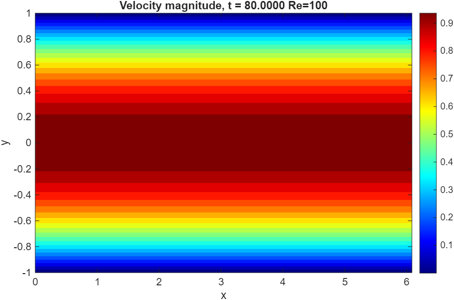
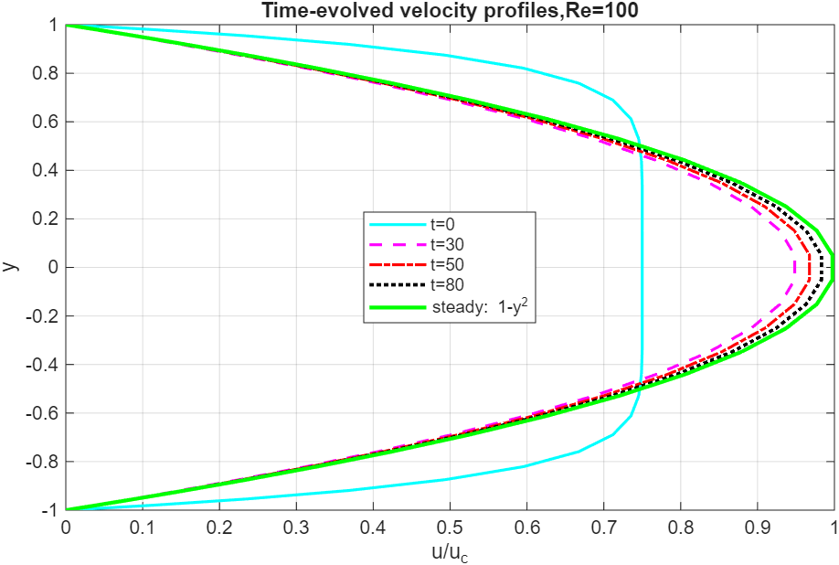

# 2D Channel Flow Solver — Fourier–Chebyshev Spectral DNS

---

## Table of Contents

1. [Problem Statement](#1-problem-statement)
2. [Domain and Boundary Conditions](#2-domain-and-boundary-conditions)
3. [Governing Equations — Incompressible Navier–Stokes](#3-governing-equations--incompressible-navierstokes)
4. [Time Discretisation — Adams–Bashforth / Crank–Nicolson](#4-time-discretisation--adamsbashforth--crank-nicolson)
5. [Fourier Transform in x](#5-fourier-transform-in-x)
6. [Chebyshev Expansion in y](#6-chebyshev-expansion-in-y)
7. [Global Coupled System — Velocity–Pressure Matrix](#7-global-coupled-system--velocitypressure-matrix)
8. [Key Design Decision — Why a Global Matrix](#8-key-design-decision--why-a-global-matrix)
9. [Special Treatment for k = 0 Mode](#9-special-treatment-for-k--0-mode)
10. [Nonlinear Terms — Pseudospectral De-aliasing](#10-nonlinear-terms--pseudospectral-de-aliasing)
11. [Viscous Terms](#11-viscous-terms)
12. [RHS Construction](#12-rhs-construction)
13. [Time Step Constraint](#13-time-step-constraint)
14. [Algorithm — Full Time Advancement Loop](#14-algorithm--full-time-advancement-loop)
15. [File Structure](#15-file-structure)
16. [Parameters](#16-parameters)
17. [Results](#17-results)

---

## 1. Problem Statement

Solve the **2D incompressible Navier–Stokes equations** in a plane channel geometry, driven by a mean pressure gradient $K$ in the streamwise ($x$) direction:

$$\frac{\partial u}{\partial t} + H_1 = K - \frac{\partial P}{\partial x} + \gamma \nabla^2 u$$

$$\frac{\partial v}{\partial t} + H_2 = -\frac{\partial P}{\partial y} + \gamma \nabla^2 v$$

$$\frac{\partial u}{\partial x} + \frac{\partial v}{\partial y} = 0$$

where $H_1 = u\,\partial u/\partial x + v\,\partial u/\partial y$ and $H_2 = u\,\partial v/\partial x + v\,\partial v/\partial y$ are the nonlinear convective terms, and $\gamma = 1/Re$.

> The mean pressure gradient $K = -2/Re$ drives the fully developed parabolic flow. The solver targets the **fully developed region** of channel flow, where statistics are homogeneous in $x$.

---

## 2. Domain and Boundary Conditions

$$x \in [0, 2\pi] \quad \text{(periodic, streamwise)}, \qquad y \in [-1, 1] \quad \text{(wall-normal, non-periodic)}$$

| Direction | Treatment | Basis |
|---|---|---|
| $x$ | Periodic | Fourier |
| $y$ | Non-periodic, walls at $y = \pm 1$ | Chebyshev |

**No-slip boundary conditions** at both walls:

$$\hat{u}(\pm 1) = 0, \qquad \hat{v}(\pm 1) = 0$$

These translate in Chebyshev coefficient space to:

$$\sum_{n=0}^{N} (\pm 1)^n a_n = 0, \qquad \sum_{n=0}^{N} (\pm 1)^n b_n = 0$$

> **Crucially:** Since pressure is solved as part of the global coupled system, **no pressure boundary condition is needed separately** — only velocity BCs are imposed. This sidesteps the pressure BC problem entirely. See [Section 8](#8-key-design-decision--why-a-global-matrix).

---

## 3. Governing Equations — Incompressible Navier–Stokes

**x-momentum:**

$$\frac{\partial u}{\partial t} + u\frac{\partial u}{\partial x} + v\frac{\partial u}{\partial y} = K - \frac{\partial P}{\partial x} + \gamma\left(\frac{\partial^2 u}{\partial x^2} + \frac{\partial^2 u}{\partial y^2}\right)$$

**y-momentum:**

$$\frac{\partial v}{\partial t} + u\frac{\partial v}{\partial x} + v\frac{\partial v}{\partial y} = -\frac{\partial P}{\partial y} + \gamma\left(\frac{\partial^2 v}{\partial x^2} + \frac{\partial^2 v}{\partial y^2}\right)$$

**Continuity:**

$$\frac{\partial u}{\partial x} + \frac{\partial v}{\partial y} = 0$$

---

## 4. Time Discretisation — Adams–Bashforth / Crank–Nicolson

The nonlinear terms are treated **explicitly** with **2nd-order Adams–Bashforth**, and the viscous terms are treated **implicitly** with **Crank–Nicolson** (trapezoidal rule). This avoids the viscous stability constraint while keeping the nonlinear terms cheap.

**x-momentum (discretised):**

$$\frac{u^{n+1} - u^n}{\Delta t} + \frac{3}{2}H_1^n - \frac{1}{2}H_1^{n-1} = K - \frac{1}{2}\left[\frac{\partial P^{n+1}}{\partial x} + \frac{\partial P^n}{\partial x}\right] + \frac{\gamma}{2}\left[\nabla^2 u^{n+1} + \nabla^2 u^n\right]$$

**y-momentum (discretised):**

$$\frac{v^{n+1} - v^n}{\Delta t} + \frac{3}{2}H_2^n - \frac{1}{2}H_2^{n-1} = -\frac{1}{2}\left[\frac{\partial P^{n+1}}{\partial y} + \frac{\partial P^n}{\partial y}\right] + \frac{\gamma}{2}\left[\nabla^2 v^{n+1} + \nabla^2 v^n\right]$$

**Continuity at $n+1$:**

$$\frac{\partial u^{n+1}}{\partial x} + \frac{\partial v^{n+1}}{\partial y} = 0$$

Collecting the known $n$-level terms to the RHS (denoted $\mathcal{B}_1$ and $\mathcal{B}_2$), and bringing all $n+1$ terms to the LHS:

$$\frac{u^{n+1}}{\Delta t} - \frac{\gamma}{2}\nabla^2 u^{n+1} + \frac{1}{2}\frac{\partial P^{n+1}}{\partial x} = \mathcal{B}_1$$

$$\frac{v^{n+1}}{\Delta t} - \frac{\gamma}{2}\nabla^2 v^{n+1} + \frac{1}{2}\frac{\partial P^{n+1}}{\partial y} = \mathcal{B}_2$$

where the known RHS vectors are:

$$\mathcal{B}_1 = -K - \frac{1}{2}\frac{\partial P^n}{\partial x} + \frac{\gamma}{2}\nabla^2 u^n - \left(\frac{3}{2}H_1^n - \frac{1}{2}H_1^{n-1}\right) + \frac{u^n}{\Delta t}$$

$$\mathcal{B}_2 = -\frac{1}{2}\frac{\partial P^n}{\partial y} + \frac{\gamma}{2}\nabla^2 v^n - \left(\frac{3}{2}H_2^n - \frac{1}{2}H_2^{n-1}\right) + \frac{v^n}{\Delta t}$$

**Implemented in:** `find_q.m` (general time step), `find_q_0.m` (first time step — Euler, since $H^{n-1}$ unavailable)

---

## 5. Fourier Transform in x

Since $x$ is periodic, apply FFT in $x$ to the discretised momentum equations. Invoking orthogonality:

**Equation (1) — x-momentum in Fourier–Chebyshev space:**

$$\frac{2}{\gamma \Delta t}\hat{u}^{n+1} - \hat{u}^{n+1}_{yy} + k^2 \hat{u}^{n+1} + \frac{ik}{\gamma}\hat{P}^{n+1} = \frac{2}{\gamma}\hat{\mathcal{B}}_1$$

**Equation (2) — y-momentum in Fourier–Chebyshev space:**

$$\frac{2}{\gamma \Delta t}\hat{v}^{n+1} - \hat{v}^{n+1}_{yy} + k^2 \hat{v}^{n+1} + \frac{1}{\gamma}\hat{P}^{n+1}_y = \frac{2}{\gamma}\hat{\mathcal{B}}_2$$

**Continuity:**

$$ik\hat{u}^{n+1} + \hat{v}^{n+1}_y = 0$$

where $\beta = 2/(\gamma \Delta t)$ and $\alpha = k^2 + \beta$.

---

## 6. Chebyshev Expansion in y

For each Fourier mode $k$, expand $\hat{u}$, $\hat{v}$, $\hat{P}$ in Chebyshev polynomials:

$$\hat{u}(y) = \sum_{n=0}^{N} a_n T_n(y), \qquad \frac{\partial^2 \hat{u}}{\partial y^2} = \sum_{n=0}^{N} a_n'' T_n(y)$$

$$\hat{v}(y) = \sum_{n=0}^{N} b_n T_n(y), \qquad \frac{\partial \hat{v}}{\partial y} = \sum_{n=0}^{N} b_n' T_n(y), \qquad \frac{\partial^2 \hat{v}}{\partial y^2} = \sum_{n=0}^{N} b_n'' T_n(y)$$

$$\hat{P}(y) = \sum_{n=0}^{N} d_n T_n(y)$$

Substituting into equations (1), (2), and continuity, and invoking Chebyshev orthogonality gives the coefficient-level equations. Expressing $a_n''$ in terms of $a_n$ (and $b_n''$ in terms of $b_n$) using the double application of the $b_n$ recursion — **identical to the Poisson solver approach** — leads to a coupled linear system per Fourier mode $k$.

---

## 7. Global Coupled System — Velocity–Pressure Matrix

For each Fourier mode $k$, the unknowns $[a_n, b_n, d_n]$ for $u$, $v$, $P$ respectively are assembled into a single **$3N \times 3N$ global matrix system**:

$$\mathbf{M}_1 \begin{bmatrix} \mathbf{a} \\ \mathbf{b} \\ \mathbf{d} \end{bmatrix} = \mathbf{M}_2$$

The $3N \times 3N$ matrix $\mathbf{M}_1$ has the block structure:

```
┌─────────────────┬──────────────┬──────────────┐
│   u-velocity    │     0        │   u–P block  │   ← rows 1..N   (u-momentum)
│   (tridiag)     │              │   (ik terms) │
├─────────────────┼──────────────┼──────────────┤
│       0         │  v-velocity  │   v–P block  │   ← rows N+1..2N (v-momentum)
│                 │   (tridiag)  │   (∂/∂y)     │
├─────────────────┼──────────────┼──────────────┤
│  continuity–u   │ continuity–v │      0       │   ← rows 2N+1..3N (continuity)
│   (ik terms)    │   (∂/∂y)     │              │
└─────────────────┴──────────────┴──────────────┘
```

**Boundary condition rows** replace the first two rows of each velocity block:

- Rows 1, 2 → $u(\pm 1) = 0$ (no-slip for $u$)
- Rows $N+1$, $N+2$ → $v(\pm 1) = 0$ (no-slip for $v$)

The tridiagonal structure within each velocity block is the same as derived in the Poisson solver — coupling $a_{n-2}$, $a_n$, $a_{n+2}$ — arising from the double Chebyshev differentiation recursion.

**Implemented in:** `global_matrix_general_k.m` (all $k \neq 0$), `global_matrix_general_k0.m` ($k = 0$ mode)

---

## 8. Key Design Decision — Why a Global Matrix

In a split or projection method, pressure is solved separately from velocity, which requires imposing **pressure boundary conditions** at the walls. However, the physically correct wall condition is on the **normal pressure gradient** ($\partial P / \partial y$), not on $P$ itself, and this couples the pressure to the velocity field in a non-trivial way at each time step.

**This solver avoids this problem entirely** by solving $u$, $v$, and $P$ simultaneously in a single global $3N \times 3N$ system. Since pressure appears as an interior unknown within the global matrix, no separate pressure BC is required — **only the velocity no-slip conditions are enforced**:

$$\hat{u}(\pm 1) = 0, \qquad \hat{v}(\pm 1) = 0$$

The continuity equation provides the additional equations that close the system and implicitly determines the correct pressure field.

> This approach is equivalent to solving the saddle-point problem for $(u, v, P)$ directly, in the spirit of the **inf-sup stable spectral formulation**.

---

## 9. Special Treatment for k = 0 Mode

The $k = 0$ (zero wavenumber) Fourier mode requires separate handling for two reasons:

**i) No $x$-pressure gradient:** The $ik\hat{P}$ coupling term in the $u$-momentum equation vanishes at $k = 0$, so the $u$–$P$ block is removed (commented out in `global_matrix_general_k0.m`). The streamwise mean flow is instead driven by the prescribed body force $K$.

**ii) Gauge condition and pressure BC:** With no $ik$ coupling, the $k = 0$ pressure is determined only up to a constant (gauge freedom). Two constraints replace the missing equations:
- **Gauge condition:** $d_0 = 0$ (fixes the pressure mean)
- **Pressure BC:** $\partial \hat{P}/\partial y\big|_{y=+1} = 0$, imposed via $\sum_{n=1}^{N-1} n^2 d_n = 0$

**Implemented in:** `global_matrix_general_k0.m` — the $u$–$P$ and $u$-continuity blocks are zeroed out, replaced by the gauge and pressure BC rows.

---

## 10. Nonlinear Terms — Pseudospectral De-aliasing

The nonlinear terms $H_1 = u\,\partial u/\partial x + v\,\partial u/\partial y$ and $H_2 = u\,\partial v/\partial x + v\,\partial v/\partial y$ are computed using the **pseudospectral method with 3/2-rule de-aliasing**:

```
1. Compute derivatives in Fourier–Chebyshev space:
      dudx̂ = ik · ûhatk          (streamwise, trivial in Fourier)
      dudy  → via Chebyshev: â → b̂ → eval at y nodes   [a_cheb_coeff + b_cheb_coeff]

2. Pad all fields to 3N/2 Fourier grid (zero-insert between positive
   and negative wavenumbers)

3. Inverse FFT to physical space on 3N/2 grid

4. Multiply in physical space:
      H1 = u · dudx + v · dudy
      H2 = u · dvdx + v · dvdy

5. Forward FFT on 3N/2 grid

6. Truncate back to N grid (discard aliased modes)

7. Inverse FFT to get H1, H2 on original N grid
```

> The 3/2-rule padding ensures that the aliasing error from the quadratic nonlinearity is fully removed — modes above $N/2$ that would fold back are discarded after the product.

**Implemented in:** `H_non_linear.m`

---

## 11. Viscous Terms

The viscous Laplacian $\nabla^2 = \partial^2/\partial x^2 + \partial^2/\partial y^2$ is computed spectrally:

**In x** (trivial in Fourier space):

$$\widehat{\partial^2 u/\partial x^2} = -k^2 \hat{u}$$

**In y** (double Chebyshev differentiation via double recursion):

$$a_n \xrightarrow{b\text{-recursion}} b_n \xrightarrow{b\text{-recursion}} c_n \equiv a_n''$$

The result $c_n$ gives $\partial^2 \hat{u}/\partial y^2$ in Chebyshev coefficient space, evaluated back at the $y$ nodes via Clenshaw.

**Implemented in:** `viscous_term.m`

---

## 12. RHS Construction

The known-side vector $\mathcal{B}$ (the $q_n$ Chebyshev coefficients fed into the global matrix RHS) is assembled from:

| Term | Time level | Computed by |
|---|---|---|
| Mean pressure gradient $K$ | prescribed | constant |
| $\partial P^n / \partial x$, $\partial P^n / \partial y$ | $n$ (known) | Fourier mult. + Chebyshev recursion |
| $\gamma/2 \cdot \nabla^2 u^n$, $\nabla^2 v^n$ | $n$ (known) | `viscous_term.m` |
| $3/2 \cdot H_1^n - 1/2 \cdot H_1^{n-1}$ | Adams–Bashforth | `H_non_linear.m` |
| $u^n / \Delta t$, $v^n / \Delta t$ | $n$ (known) | direct |

After assembling $\mathcal{B}_{1,2}$ in physical space, FFT in $x$ then Chebyshev transform in $y$ gives the $q_n$ coefficients:

$$\mathcal{B} \xrightarrow{\text{FFT}_x} \hat{\mathcal{B}}(k,y) \xrightarrow{\text{DCT}_y} q_n(k)$$

**Implemented in:** `find_q.m` (steps $n \geq 1$), `find_q_0.m` (step $n = 0$, Euler: $H^{n-1} = H^n$)

---

## 13. Time Step Constraint

The time step is controlled by both **convective CFL** and **diffusive stability**:

$$\Delta t_{\text{conv}} = \text{CFL} \cdot \min\left(\frac{\Delta x}{|u|_{\max}},\; \frac{\Delta y_{\min}}{|v|_{\max}}\right)$$

$$\Delta t_{\text{diff}} = \frac{0.5}{\gamma\left(1/\Delta x^2 + 1/\Delta y_{\min}^2\right)}$$

$$\Delta t = \min(\Delta t_{\text{conv}},\; \Delta t_{\text{diff}})$$

where $\Delta y_{\min}$ is the minimum Chebyshev node spacing (near the walls), which is $O(1/N^2)$.

**Implemented in:** `dt_channel.m`

---

## 14. Algorithm — Full Time Advancement Loop

```
INITIALISATION:
  Set up Fourier grid (x), Chebyshev nodes (y), wavenumbers k_x
  Set Re, K = -2/Re, γ = 1/Re
  Initialise u(x,y,t=0), v(x,y,t=0)   ← parabolic profile + perturbation

t = 0 STEP (Euler — no H^{n-1} available):
  1. FFT u₀, v₀ → ûhatk₀, v̂hatk₀
  2. Compute H1, H2     [H_non_linear]     (pseudospectral, 3/2 de-aliased)
  3. Compute ∇²u, ∇²v  [viscous_term]
  4. Solve pressure at t=0 [pressure_0th_tmstp]  → P₀, dP0dx, dP0dy
  5. Compute dt          [dt_channel]
  6. Build RHS q_n       [find_q_0]
  7. Solve global system [uvp_cheb_solver]  → û, v̂, P̂ → u, v, dPdx, dPdy

TIME LOOP (t > 0, Adams–Bashforth / Crank–Nicolson):
  While t < T:
    1.  Compute dt              [dt_channel]
    2.  Compute H1_new, H2_new  [H_non_linear]   (using û, v̂ from previous step)
    3.  Compute ∇²u, ∇²v       [viscous_term]
    4.  Build RHS q_n           [find_q]          (uses H1_new, H1_old for AB2)
    5.  Solve global system     [uvp_cheb_solver] → û, v̂, u, v, dPdx, dPdy
    6.  Check continuity:  max|∂u/∂x + ∂v/∂y| → printed each step
    7.  Update H1_old = H1_new, H2_old = H2_new
    8.  Advance t = t + dt

  uvp_cheb_solver per step:
    For each Fourier mode k:
      ├─ k=0: global_matrix_general_k0  (gauge + pressure BC)
      └─ k≠0: global_matrix_general_k   (full u–v–P coupling)
    Extract a_n (u), b_n (v), d_n (P) from 3N solution vector
    Reconstruct û(y), v̂(y), P̂(y) via Clenshaw   [cheb_eval_series]
    IFFT → u(x,y), v(x,y)
    Compute dPdx, dPdy via Fourier mult + Chebyshev recursion
```

---

## 15. File Structure

| File | Role | Called by |
|---|---|---|
| `main_ChannelFlow.m` | Driver: grid, IC, time loop, continuity check, live contour | — |
| `main_ChannelFlow_withPlots.m` | Driver with saved velocity profiles at $t = 0, 10, 30, 50$ | — |
| `H_non_linear.m` | Nonlinear terms $H_1$, $H_2$ with 3/2-rule de-aliasing | `main_ChannelFlow.m` |
| `viscous_term.m` | $\partial^2 u/\partial x^2$, $\partial^2 u/\partial y^2$ etc. spectrally | `main_ChannelFlow.m` |
| `pressure_0th_tmstp.m` | Pressure at $t=0$ via standalone Poisson solve | `main_ChannelFlow.m` |
| `find_q_0.m` | RHS Chebyshev coefficients at $t=0$ (Euler step) | `main_ChannelFlow.m` |
| `find_q.m` | RHS Chebyshev coefficients $t>0$ (Adams–Bashforth) | `main_ChannelFlow.m` |
| `uvp_cheb_solver.m` | Loop over Fourier modes, solve global matrix, reconstruct fields | `main_ChannelFlow.m` |
| `global_matrix_general_k.m` | Assembles and solves $3N\times3N$ system for $k \neq 0$ | `uvp_cheb_solver.m` |
| `global_matrix_general_k0.m` | Assembles and solves $3N\times3N$ system for $k = 0$ (gauge fix) | `uvp_cheb_solver.m` |
| `solve_tridiag_dn.m` | Tridiagonal solve for pressure coefficients $d_n$ (0th step) | `pressure_0th_tmstp.m` |
| `tridiag_struc_even.m` | Builds even-mode tridiagonal blocks | `solve_tridiag_dn.m` |
| `tridiag_struc_odd.m` | Builds odd-mode tridiagonal blocks | `solve_tridiag_dn.m` |
| `a_cheb_coeff.m` | Forward DCT: physical values → Chebyshev coefficients $a_n$ | multiple |
| `b_cheb_coeff.m` | Recursion: $a_n \to b_n$ (derivative coefficients) | multiple |
| `cheb_eval_series.m` | Inverse: $b_n \to$ physical values via Clenshaw recurrence | multiple |
| `dt_channel.m` | CFL + diffusive time step constraint | `main_ChannelFlow.m` |

### Call Graph

```
main_ChannelFlow.m
│
├── H_non_linear.m           ← H1, H2  (3/2 de-aliased pseudospectral)
│   ├── a_cheb_coeff.m
│   ├── b_cheb_coeff.m
│   └── cheb_eval_series.m
│
├── viscous_term.m           ← ∇²u, ∇²v
│   ├── a_cheb_coeff.m
│   ├── b_cheb_coeff.m
│   └── cheb_eval_series.m
│
├── pressure_0th_tmstp.m     ← P₀ (standalone Poisson at t=0 only)
│   ├── a_cheb_coeff.m
│   ├── b_cheb_coeff.m
│   ├── cheb_eval_series.m
│   └── solve_tridiag_dn.m
│       ├── tridiag_struc_even.m
│       └── tridiag_struc_odd.m
│
├── find_q_0.m / find_q.m   ← RHS q_n coefficients
│   └── a_cheb_coeff.m
│
├── dt_channel.m             ← adaptive Δt
│
└── uvp_cheb_solver.m        ← global coupled solve per Fourier mode
    ├── global_matrix_general_k0.m   (k=0)
    ├── global_matrix_general_k.m    (k≠0)
    ├── a_cheb_coeff.m
    ├── b_cheb_coeff.m
    └── cheb_eval_series.m
```

---

## 16. Parameters

| Parameter | Symbol | Value | Description |
|---|---|---|---|
| Grid points | $N_x$ | `32` | Fourier modes in $x$; Chebyshev modes in $y$ |
| Domain length | $L$ | $2\pi$ | Periodic streamwise box |
| Reynolds number | $Re$ | `100` / `350` | Sets $\gamma = 1/Re$, $K = -2/Re$ |
| Body force | $K$ | $-2/Re$ | Mean pressure gradient driving flow |
| CFL number | CFL | `0.2` | Conservative, accounts for Chebyshev $O(N^{-2})$ spacing |
| Simulation time | $T$ | `10` / `50` | Total time |
| Initial condition | — | $u = 0.75(1-y^8)$ or parabola + perturbation | Depends on driver script |

---

## 17. Results

All results are for $Re = 100$, $N_x = 32$.

### Fully Developed Velocity Profile

<p align="center">
  
</p>

### Time-Evolved Velocity Profiles

Streamwise velocity profiles $u/u_c$ at $x = L/2$ captured at $t = 0, 30, 50, 80$, converging to the parabolic Poiseuille profile $u = 1 - y^2$.

<p align="center">
  
</p>

> The solver enforces incompressibility ($\nabla \cdot \mathbf{u} = 0$) to machine precision at every time step — verified by the printed `max div` output. The velocity profiles converge to the exact parabolic solution $u = 1 - y^2$ as $t \to \infty$, consistent with fully developed laminar channel flow at the given $Re$.If you look, possibly if we crank up the time(*t*) to *100* or more, the numerical results would match the analytical solution exactly, which demonstrates the robustness of spectral accuracy.

---

## Reference

> Moin, P., & Kim, J. (1980). *On the numerical solution of time-dependent viscous incompressible fluid flows involving solid boundaries.* Journal of computational physics, 35(3), 381-392.

---

*Solver: 2D Incompressible Navier–Stokes — Fourier (x) × Chebyshev (y) spectral DNS with Adams–Bashforth / Crank–Nicolson time advancement and global coupled velocity–pressure matrix (no pressure BC required).*
